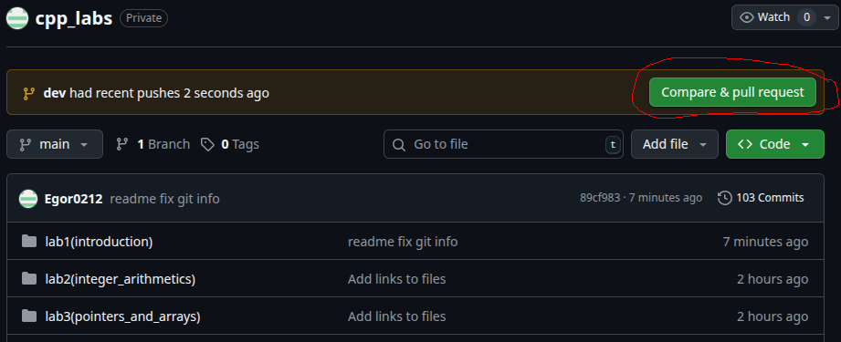
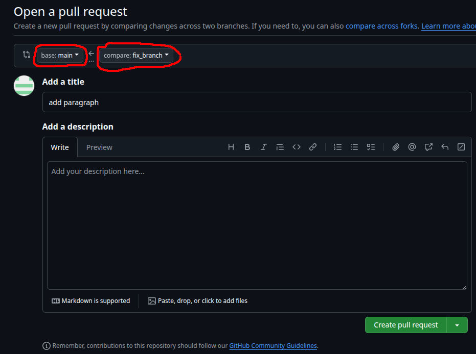
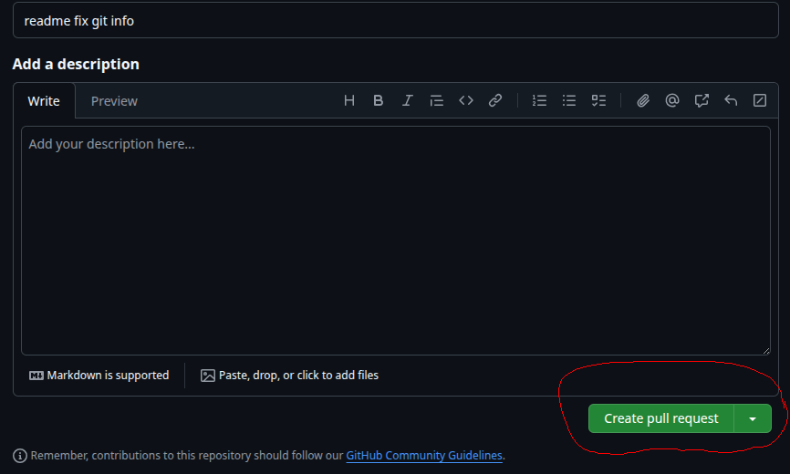
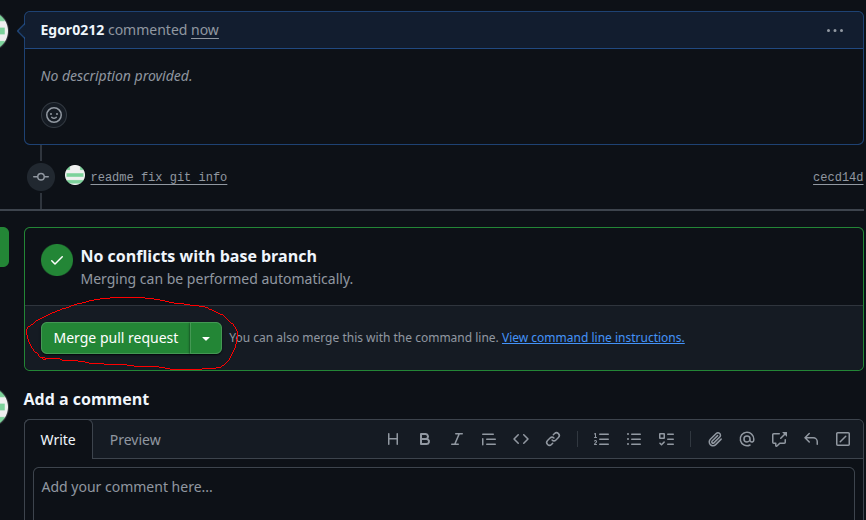
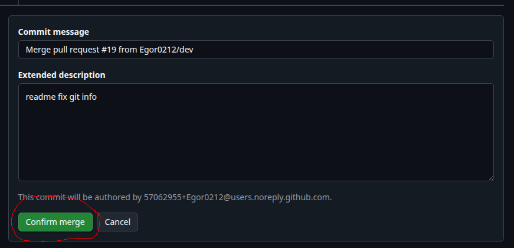
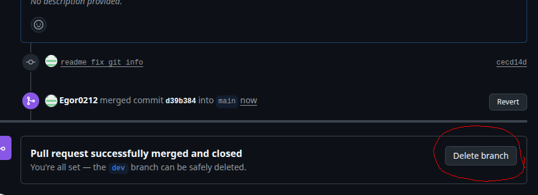

# Работа с Git

Здесь будут разобраны основные моменты, которые понадобятся для работы с системой версий Git:

1. Клонирование репозитория
2. Создание веток
3. Обновление репозитория
4. Синхронизация вашего удалённого репозитория с локальным
5. Слияние веток и pull request

## Клонирование репозитория

Вы сделали ответвление (fork) основного репозитория себе на аккаунт (это мы обсудили на занятии). Для начала работы с этим репозиторием нужно "клонировать" его локальную копию себе на компьютер:
```shell
git clone "ссылка на ваш репозиторий"
```

## Создание веток
После клонирования ответвленного репозитория себе вы увидите в нём только одну ветку (она называется **main**), с которой вы будете продолжать работать на протяжении всего семестра. Обычно изменения в эту ветку загружаются на самой последней стадии разработки (после ревью кода, тестирования и т.п.). Для упрощения вы можете работать напрямую с веткой main (вам тогда не понадобится никакого слияния веток), но я рекомендую сразу учиться делать хорошо, чтобы потом не переучиваться.

> Стоит отметить, что ещё в репозитории помимо ветки main создают ещё так называемую ветку **dev**. Она служит в качестве "интеграционной" ветки, где собираются изменения из различных веток разработки (их обычно называют **feature-ветки**) перед тем, как они будут объединены в основную ветку main (или master).
 
Обычно для каждой новой задачи создаётся своя feature-ветка с характерным для этого названием (например feature1_add_logic, featue_solve_task1 и т.п), в которой работают только над одной конкретной задачей. Создать ветку можно, например, с помощью следующей команды:

```shell
git checkout -b "название_ветви"
```
При создании ветви командой выше, вы автоматически на неё перейдете. Но настоятельно рекомендую проверить, на какой ветви вы находитесь Это можно сделать с помощью команды **git status**. Если же вы по какой-то причине не перешли на свою ветвь, то это можно сделать, например, с помощью следующей команды:
```shell
git switch "название ветви"
```
Или этой команды:
```shell
git checkout "название ветви"
``` 

После чего можно приступать к работе в этой ветке. После окончания работы с этой веткой её обычно сливают с какой-то из основных (в нашем случае это ветка main), а саму ветку, как правило, удаляют.


## Обновление репозитория

Периодически репозиторий с заданиями может обновляться. Загрузить последнюю версию ветки main себе в ответвлённый репозиторий можно прямо на сайте github (над вашим репозиторием будет кнопка **"Sync fork" -> "Update Branch"**). Чтобы загрузить эти изменения локально, нужно выполнить следующие команды:

```shell
# Убедитесь, что находитесь у себя в ветке main
# и у вас нет локальных изменений,
# если есть — зафиксируйте локальную работу (см. "Задания к лабоработной работе №1")
git checkout main
git status
# после выполнения полследней команды должно быть
# написано следующее:
# On branch main
# Your branch is up to date with 'origin/main'.
# nothing to commit, working tree clean

git pull # синхронизации локального репозитория с удаленным
```

Ниже покажу два способа, как всё можно сделать через консоль (будет немного сложнее, чем команда git pull + возможны конфликты):
```shell
# Общее для двух способов:

# добавить мой репозиторий с заданиями как удалённый (remote) с 
# названием upstream (делается один раз!)
git remote add upstream git@github.com:Egor0212/fpmi_cpp_labs.git

# Далее убедитесь, что находитесь у себя в ветке main
# и у вас нет локальных изменений (разобрано выше)
```

1. С помощью merge (слияния):
    ```shell
    # "Вытягивание" изменений из моего удалённого 
    # репозитория в ваш локальный
    # по сути git pull = git fetch + git merge
    git pull upstream main

    # Обновления вашего удалённого репозитория
    git push origin main
    ```  

2. С помощью rebase ("переноса"):
    ```shell
    # "Извлечь" (fetch) все ветви из моего удалённого репозитория в ваш
    git fetch upstream

    # Убедитесь, что находитесь у себя в ветке main
    git checkout main

    # Перенести коммиты из моей ветви в вашу
    git rebase upstream/main

    # Загрузить изменения в ваш удалённый репозиторий
    # (параметр -f используется только первый раз после rebase)
    git push -f origin main
    ```

## Синхронизация вашего удалённого репозитория с локальным

Итак, вам нужно загрузить ваши файлы на удалённый репозиторий (чтобы они отображались на сайте). После выполнения команды **git status** вы увидите название вашей текущей рабочей ветки и список файлов, с которыми вы работали локально на компьютере. Теперь нам нужно зафиксировать эти изменения и добавить их на удалённый репозиторий:

1. Добавляем все изменения перед созданием коммита:
    ```shell
    git add/rm "Название файла"
    # git add/rm * --- добавить все изменения
    # git add/rm . --- добавить все изменения в текущей директории
    ```
2. Сам коммит:
    ```shell
    git commit -m "Что изменилось/добавилось/удалилось"
    ```
3. Загружаем эти изменения в вашей ветке из вашего локального репозитория на удаленный:
    ```shell
    git push origin "название_ветки" 
    # например, git push origin main
    ```

## Слияние веток и pull request
Если для выполнения задания вы создавали отдельную ветку, то эту ветку можно слить (merge) с вашей веткой main. Это тоже можно сделать несколькими способами:

1. Прямо на сайте github в своём репозитории. Сначала нужно опубликовать вашу ветку (для этого можно использовать команды выше). После чего сайт вам сайт предложит создать **pull request** (над репозиторием будет кнопка **Compare & pull request**) и затем слить ветки (не забудьте указать, какие ветки вы будете сливать!):
    - <ins>Compare & pull request</ins>
        
    - <ins> Выбор веток для слияния:</ins>
        
    - <ins>Create pull request</ins>
        
    - <ins>Merge pull request</ins>
        
    - <ins>Confirm merge</ins>
        
    - <ins>Delete branch</ins>
        

    Обратите внимание, что делается это в удалённом репозитории (на сайте), т.е. локально ваша ветка не удалена и не слита с веткой main! (если вы хотите удалить ветку локально, сначала нужно перейти на другую ветку, а затем воспользоваться командой: `git branch -d "название_ветки"`). После чего можно воспользоваться командой `git pull` для синхронизации локального репозитория с удаленным.


2. С помощью команд терминала:
    ```shell
        # Добавляем изменения из нашей отдельной ветки
        git add/rm *
        git commit -m "Что изменилось/добавилось/удалилось"

        # Переходим в ветку main
        git checkout main

        # Сливаем изменения из нашей ветки с main (возможны конфликты)
        git merge "название_ветки"

        # Удаляем нашу отдельную ветку,
        # ведь она нам больше не нужна (не ветку main!!!!)
        git branch -d "название_ветки"

        # загружаем изменения на удалённый репозиторий
        git push origin main
    ```